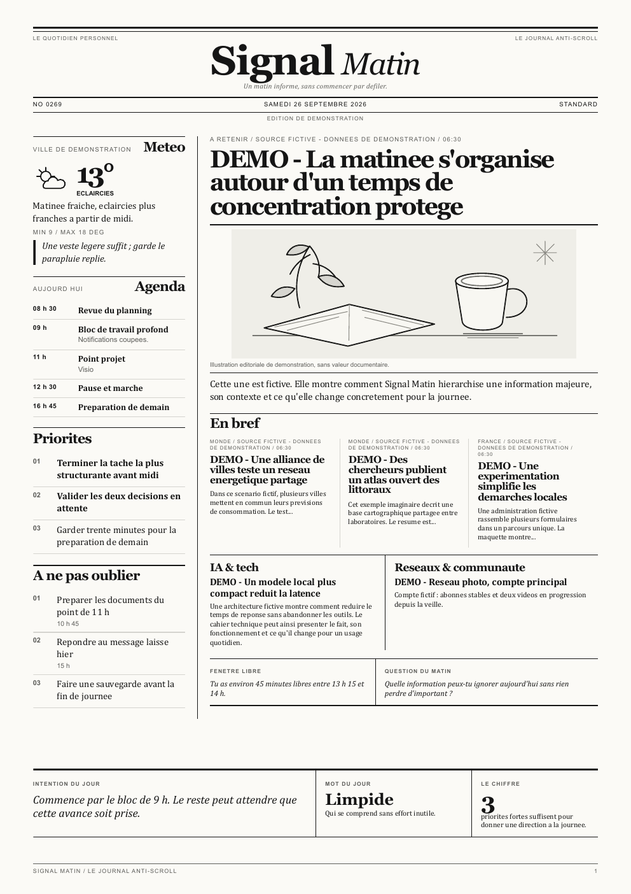

# Signal Matin

[](https://github.com/sosoj92/signal-matin/actions/workflows/tests.yml)
[](https://www.python.org/downloads/)
[](LICENSE)

Un petit quotidien personnel A4, genere le matin pour remplacer le premier
scroll du telephone. Il assemble uniquement les sources choisies, compose un
vrai journal monochrome et peut produire un PDF ou l'envoyer a l'imprimante.



> **Pour essayer, aucune API, aucun compte et aucune imprimante ne sont
> necessaires.** Le mode demo fonctionne avec des donnees fictives.

## Ce que Signal Matin peut contenir

- meteo, agenda, priorites, taches et rappels ;
- actualites generales avec breves, articles developpes et pages focus ;
- actualites IA / tech, flux RSS, veille et recommandations ;
- mot francais, vocabulaire tech, quiz, calcul mental et mots croises ;
- trois densites : `compact`, `standard` et `extended` ;
- pagination adaptative : si une rubrique est plus longue, une vraie page de
  suite est creee au lieu de couper le texte ou de tout rapetisser ;
- apercu navigateur, PDF A4, impression facultative et recto verso ;
- lancement quotidien sous Windows, macOS ou Linux.

## Installation ultra simple — debutants

### 1. Recuperer le projet

La methode sans Git :

1. clique sur le bouton vert **Code** en haut de cette page ;
2. choisis **Download ZIP** ;
3. decompresse le ZIP ;
4. ouvre le dossier `signal-matin` obtenu.

Ou, si Git est deja installe :

```bash
git clone https://github.com/sosoj92/signal-matin.git
cd signal-matin
```

### 2. Installer Python

Installe [Python 3.11 ou plus recent](https://www.python.org/downloads/).

Sous Windows, coche **Add Python to PATH** dans la premiere fenetre de
l'installateur. Pour verifier :

```bash
python --version
```

Le resultat doit commencer par `Python 3.11`, `3.12`, `3.13` ou une version
plus recente. Sous Windows, si `python` n'est pas reconnu, essaie `py`.

### 3. Lancer l'installation guidee

Ouvre un terminal dans le dossier `signal-matin` :

- **Windows 11** : clique dans la barre d'adresse de l'Explorateur, ecris
  `powershell`, puis appuie sur Entree ;
- **macOS / Linux** : ouvre Terminal, ecris `cd ` avec un espace, glisse le
  dossier dans la fenetre, puis appuie sur Entree.

Lance ensuite :

```bash
python scripts/setup.py
```

Sous Windows, tu peux utiliser ceci si necessaire :

```powershell
py scripts/setup.py
```

Le programme :

1. cree un environnement Python isole dans `.venv` ;
2. installe les dependances ;
3. installe Chromium pour fabriquer les PDF ;
4. cree un `config.yaml` local de demonstration ;
5. verifie l'installation ;
6. ouvre un vrai journal fictif dans le navigateur.

Il ne lance jamais d'impression pendant l'installation.

### 4. Verifier ou reparer

```bash
# Windows
.\.venv\Scripts\python.exe scripts\doctor.py

# macOS / Linux
./.venv/bin/python scripts/doctor.py
```

Chaque ligne indique `OK`, `INFO` ou l'action exacte a effectuer.

### Se faire guider par une IA

Le fichier [INSTALL_WITH_AI.md](INSTALL_WITH_AI.md) contient un prompt pret a
copier dans une IA. Il lui demande de t'accompagner une etape a la fois, sans
jamais lui envoyer tes cles, tokens ou calendriers prives.

### Installation manuelle — pour les personnes a l'aise avec un terminal

```bash
git clone https://github.com/sosoj92/signal-matin.git
cd signal-matin
python -m venv .venv
```

Active l'environnement avec `.\.venv\Scripts\Activate.ps1` sous Windows ou
`source .venv/bin/activate` sous macOS/Linux, puis lance :

```bash
pip install -e .
playwright install chromium
```

Enfin, copie la configuration d'exemple et ouvre la demo :

```powershell
# Windows PowerShell
Copy-Item config.example.yaml config.yaml
python main.py --preview --demo
```

```bash
# macOS / Linux
cp config.example.yaml config.yaml
python main.py --preview --demo
```

## Utilisation quotidienne

Les commandes ci-dessous supposent que l'environnement est active. Pour
l'activer :

```bash
# Windows PowerShell
.\.venv\Scripts\Activate.ps1

# macOS / Linux
source .venv/bin/activate
```

Puis :

```bash
python main.py --preview   # ouvre l'apercu HTML
python main.py --generate  # cree JSON + HTML + PDF
python main.py --print     # prepare l'impression, sans l'envoyer
```

La CLI installee propose les memes operations :

```bash
signal-matin preview --demo
signal-matin generate --demo --mode standard
signal-matin print --live --printer "Nom exact" --duplex --confirm
```

`print` n'envoie rien sans `--confirm`.

Les fichiers sont ranges par date :

```text
output/data/2026-09-26-signal-matin.json
output/preview/2026-09-26-signal-matin.html
output/pdf/2026-09-26-signal-matin.pdf
```

## Passer de la demo a ses vraies donnees

Ouvre `config.yaml` dans un editeur de texte, remplace `demo: true` par
`demo: false`, puis active uniquement les modules souhaites :

```yaml
modules:
  weather: true
  calendar: true
  tasks: true
  news: true
  tech: true
  rss: true
  games: true
  tech_vocabulary: true
  recommendations: true
```

Tout est facultatif. Une source absente ou en panne ne bloque pas le reste du
journal. Signal Matin n'invente pas une actualite pour remplir un trou.

### Meteo sans cle API

Open-Meteo fonctionne gratuitement et sans compte :

```yaml
weather:
  location: "Lyon"
  latitude: 45.7640
  longitude: 4.8357
```

### Flux RSS et actualites

```yaml
news:
  limit: 12
  max_age_hours: 72
  feeds:
    - name: "Nom du media"
      category: "Monde"
      url: "https://media.example/rss.xml"

tech:
  limit: 6
  feeds:
    - name: "Veille tech"
      category: "Tech"
      url: "https://tech.example/rss.xml"
```

Les titres, resumes, dates, URLs et medias restent associes a chaque article,
mais le journal imprime ne montre pas les details techniques du connecteur.

### Agenda ICS

Un fichier `.ics` local ou une URL ICS fonctionne :

```yaml
calendar:
  ics:
    - name: "Agenda personnel"
      source: "calendars/agenda.ics"
```

Une URL ICS peut donner acces a ton agenda : ne la publie jamais.

### Google Calendar

Installe d'abord l'option Google :

```bash
pip install -e ".[google]"
```

Dans Google Cloud Console, cree un client OAuth de type **application de
bureau**, telecharge-le sous `credentials.json`, puis configure :

```yaml
calendar:
  google:
    enabled: true
    calendar_id: "primary"
    credentials_file: "credentials.json"
    token_file: "token.json"
```

Connecte ensuite le compte une seule fois :

```bash
signal-matin auth-google
```

L'acces est en lecture seule. Les fichiers OAuth sont ignores par Git.

### Priorites et rappels

```yaml
tasks:
  priorities:
    - title: "Finaliser le dossier principal"
      importance: "high"
    - "Faire le point avant midi"
  reminders:
    - title: "Envoyer le compte rendu"
      due: "2026-09-26T16:00:00+02:00"
      context: "Travail"
```

Le fichier [config.example.yaml](config.example.yaml) documente toutes les
options avec des exemples generiques.

## Choisir le nombre et la densite des pages

```bash
signal-matin generate --demo --mode compact
signal-matin generate --demo --mode standard
signal-matin generate --demo --mode extended
```

| Mode | Pour quoi faire |
|---|---|
| `compact` | Brief rapide, peu de contenu, environ quatre pages. |
| `standard` | Edition quotidienne equilibree. |
| `extended` | Plus de developpements et de cahiers. |
| `auto` | Choix d'apres la quantite de contenu. |

Le nombre final n'est pas rigide. Le moteur mesure les vraies pages dans
Chromium. Si un article, une liste ou une rubrique deborde, il cree une page de
suite, renumerote le journal et conserve un A4 lisible.

## Impression

Teste d'abord sans envoyer de papier :

```bash
signal-matin print --demo --printer "Nom exact"
```

Puis confirme explicitement :

```bash
signal-matin print --live --printer "Nom exact" --duplex --confirm
```

- Windows utilise le pilote selectionne et un rendu plein A4 ;
- macOS et Linux utilisent CUPS (`lp`) ;
- aucune impression n'est lancee pendant l'installation ou les tests.

## Automatiser chaque matin

### Windows — Planificateur de taches

Generation seule a 8 h :

```powershell
powershell -ExecutionPolicy Bypass -File .\scripts\install_windows_task.ps1 -Time "08:00"
```

Impression recto verso :

```powershell
powershell -ExecutionPolicy Bypass -File .\scripts\install_windows_task.ps1 `
  -Time "08:00" -Print -Duplex -Printer "Nom exact de l'imprimante"
```

Le script memorise le Python de `.venv`, le dossier du projet et l'imprimante.
L'heure choisie est l'heure de **demarrage de la collecte** : avec beaucoup de
sources, le papier peut sortir quelques minutes plus tard.

Pour faire un essai dans une minute sans laisser Codex ou un terminal ouvert :

```powershell
powershell -ExecutionPolicy Bypass -File .\scripts\programmer_impression_signal_matin.ps1 -DansMinutes 1
```

Ou pour la prochaine occurrence d'une heure precise :

```powershell
powershell -ExecutionPolicy Bypass -File .\scripts\programmer_impression_signal_matin.ps1 -Heure "18:30"
```

Le test reutilise exactement l'action de la tache quotidienne `Signal Matin`.
Il refuse de continuer si cette tache a ete installee sans l'option `-Print`.

### macOS / Linux — cron

Le script affiche la ligne a ajouter, sans modifier la crontab tout seul :

```bash
sh scripts/install_cron.sh 08:00 generate
sh scripts/install_cron.sh 08:00 print
```

## Architecture

```text
Sources facultatives
  RSS / Open-Meteo / ICS / Google Calendar / YAML
                    |
                    v
          Connectors / Adapters
                    |
                    v
       Normalisation Pydantic stricte
                    |
                    v
          MorningEdition JSON
                    |
                    v
          Regles editoriales
                    |
                    v
       Renderer HTML/CSS autonome
                    |
                    v
      Playwright / Chromium -> PDF A4
                    |
                    v
          Impression facultative
```

Les donnees et le design restent separes :

- `src/signal_matin/connectors/` lit les sources ;
- `models.py` definit le contrat JSON ;
- `pipeline.py` orchestre et hierarchise ;
- `renderer.py` ne connait aucune cle ni API ;
- `web/signal_matin.css` porte la direction artistique ;
- `signal_matin_pagination.js` cree les pages de suite si necessaire ;
- `pdf.py` mesure chaque A4 avant l'export ;
- `printer.py` exige une confirmation explicite.

## Ajouter un connecteur

1. Ajoute un module dans `src/signal_matin/connectors/`.
2. Retourne des modeles normalises et un `DataSourceStatus`.
3. Branche-le dans `pipeline.py`, jamais dans le renderer.
4. Ajoute un exemple generique dans `config.example.yaml`.
5. Ecris un test avec des donnees fictives, sans appel reseau reel.

Un connecteur ne doit jamais ecrire de secret dans le JSON ou les logs. Une
erreur ne doit degrader que sa propre section.

## Personnaliser le design

La feuille `web/signal_matin.css` est concue pour `@page { size: A4 }`. Conserve
les marges physiques et lance les tests de debordement apres chaque changement :

```bash
signal-matin preview --demo --mode standard
pytest tests/test_renderer.py
```

## Tests et contribution

```bash
pip install -e ".[dev]"
playwright install chromium
pytest
```

La CI verifie les modeles, les sections absentes, le HTML, les trois densites,
la pagination dynamique, les debordements et le format A4. Voir aussi
[CONTRIBUTING.md](CONTRIBUTING.md).

## Confidentialite

- `.env`, `config.yaml`, OAuth, calendriers et sorties sont ignores par Git ;
- les URLs privees restent uniquement sur la machine de l'utilisateur ;
- aucune donnee personnelle n'est necessaire pour le mode demo ;
- l'impression demande toujours une action volontaire ;
- ce depot est autonome et ne depend d'aucun assistant personnel.

## Depannage

**`python` n'est pas reconnu sous Windows**

Reinstalle Python en cochant **Add Python to PATH**, ou essaie
`py scripts/setup.py`.

**PowerShell refuse `Activate.ps1`**

Tu n'as pas besoin d'activer l'environnement : utilise directement
`.\.venv\Scripts\python.exe main.py --preview --demo`.

**Chromium est introuvable**

Lance `.\.venv\Scripts\python.exe -m playwright install chromium` sous Windows,
ou `./.venv/bin/python -m playwright install chromium` sous macOS/Linux.

**Une source ne s'affiche pas**

Verifie qu'elle est activee dans `modules`, puis lance `python scripts/doctor.py`.
Les autres rubriques continueront de fonctionner.

**L'impression quotidienne ne part pas**

Ouvre le Planificateur de taches et consulte l'historique de `Signal Matin`.
Reinstalle la tache avec `-Print`, puis fais un essai avec `-DansMinutes 1`.

**Une page est plus longue que d'habitude**

C'est normal : le moteur ajoute une page de suite lorsque la quantite de texte
l'exige, au lieu de tronquer l'information.

## Licence

MIT. Voir [LICENSE](LICENSE).
